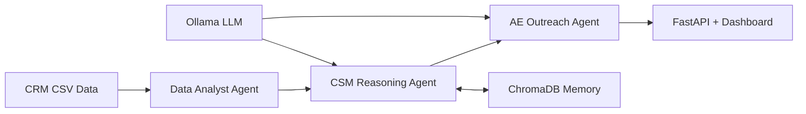

# 🧠 CRM Intelligence Pipeline

> An AI-powered customer success intelligence system that analyses CRM data, predicts churn risk, generates account health insights, and drafts personalised outreach — running entirely on local LLMs with zero cloud dependency.

---

<div align="center">


</div>

---

## 📌 What Is This?

The **CRM Intelligence Pipeline** is a fully local, containerised, multi-agent AI system that simulates a Salesforce-style CRM intelligence layer. It ingests customer data, computes behavioural health signals, scores churn risk using a local LLM, and generates tailored proactive outreach emails — all in a single `docker compose up`.

### Who Is It For?

- **Engineers** exploring local-first AI system design and multi-agent orchestration
- **Data practitioners** interested in RAG-enabled CRM intelligence
- **AI practitioners** building production-style pipelines without cloud LLM dependency
- **Hiring managers** evaluating AI systems engineering capability

### Why Does It Matter?

Most CRM intelligence tools rely on proprietary cloud APIs — expensive, privacy-constraining, and unavailable offline. This project demonstrates that production-quality customer intelligence is achievable entirely on local infrastructure, making it viable for enterprises with strict data residency requirements.

### What Makes It Technically Interesting?

- **Multi-agent orchestration** — three specialised agents, each with a distinct role and reasoning pattern
- **Hybrid scoring** — deterministic rule-based guardrails combined with LLM probabilistic reasoning
- **RAG-enabled memory** — ChromaDB provides per-account vector context to the reasoning agent
- **Full containerisation** — ChromaDB healthcheck ensures correct startup ordering
- **Zero cloud dependency** — runs on Ollama (`llama3.1:8b`) with no external API calls

---

## ✨ Features

| Feature | Description |
|---|---|
| 🔴🟡🟢 **Health Scoring** | Red / Amber / Green classification per account |
| 📉 **Churn Prediction** | Renewal probability scored per account with confidence level |
| 🧠 **AI Account Summaries** | LLM-generated reasoning over behavioural signals |
| ✉️ **Automated Outreach Drafts** | Personalised email generated per account |
| 🗂️ **RAG-Enabled Memory** | ChromaDB retrieves historical account context per query |
| 🌐 **REST API** | 5 FastAPI endpoints for programmatic access |
| 📊 **Interactive Dashboard** | Health cards, donut chart, filterable table, one-click email copy |
| 🐳 **Single-Command Startup** | Full stack launches with `docker compose up -d` |
| 🔒 **Local-First** | No data leaves your machine |

---

## 🏗️ Architecture

### Agent Pipeline



### System Overview

```
┌─────────────────────────────────────────────────────────────────┐
│                        INGESTION LAYER                          │
│   Salesforce-style CSVs: Accounts · Contacts · Tickets         │
│   Opportunities · Usage Records · Email Threads                 │
└──────────────────────────────┬──────────────────────────────────┘
                               │
┌──────────────────────────────▼──────────────────────────────────┐
│                     ORCHESTRATION LAYER                         │
│                                                                 │
│  ┌──────────────┐    ┌──────────────┐    ┌──────────────────┐  │
│  │  Agent 1     │    │  Agent 2     │    │  Agent 3         │  │
│  │  Data        │───▶│  Customer    │───▶│  Account         │  │
│  │  Analyst     │    │  Success Mgr │    │  Executive       │  │
│  │  (Pandas)    │    │  (LLM+Chroma)│    │  (Email + JSON)  │  │
│  └──────────────┘    └──────────────┘    └──────────────────┘  │
└──────────────────────────────┬──────────────────────────────────┘
                               │
              ┌────────────────┴────────────────┐
              │                                 │
┌─────────────▼──────────┐       ┌──────────────▼────────────┐
│     MEMORY LAYER       │       │       OUTPUT LAYER        │
│     ChromaDB           │       │  FastAPI  (port 8080)     │
│     (port 8001)        │       │  Dashboard · JSON reports │
└────────────────────────┘       └───────────────────────────┘
```

### The Three-Agent Team

| Agent | Technology | Input | Output |
|---|---|---|---|
| **Data Analyst (DA)** | Python + Pandas | Raw CSVs | Structured metrics JSON |
| **CSM Reasoning Agent** | Ollama `llama3.1:8b` + ChromaDB | DA metrics + vector context | Risk level, confidence, churn reasons |
| **Account Executive (AE)** | Ollama `llama3.1:8b` | CSM assessment | Email draft + structured report |

---

## 💡 Why Local LLMs?

This project makes a deliberate architectural choice to run entirely on local models. Here's why that matters:

| Concern | Cloud LLMs | Local LLMs (This Project) |
|---|---|---|
| **Data Privacy** | Customer data sent to third-party servers | All data stays on your machine |
| **Cost** | Per-token billing at scale | Zero ongoing API cost |
| **Data Residency** | Jurisdiction-dependent | Fully controlled |
| **Offline Operation** | Requires internet | Works completely offline |
| **Enterprise Suitability** | Requires DPA agreements | No external agreements needed |
| **Latency** | Network-dependent | Local inference only |

For enterprises handling sensitive CRM data — GDPR-regulated customer records, NPS scores, support ticket content — local inference eliminates an entire category of compliance risk.

---

## 📥 Example: Input → Output

### Input (`accounts.csv` excerpt)

```csv
account_id,company_name,industry,contract_value,renewal_date,nps_score
ACC-0042,Meridian Technologies,SaaS,48000,2024-03-15,-22
ACC-0017,Helix Dynamics,Manufacturing,92000,2024-04-01,31
```

### Output (`full_report.json` excerpt)

```json
{
  "account_id": "ACC-0042",
  "account_name": "Meridian Technologies",
  "health_score": "Red",
  "renewal_probability": 0.23,
  "confidence": "High",
  "churn_reasons": [
    "Support ticket volume increased 340% in last 30 days",
    "Login frequency dropped 62% month-over-month",
    "NPS score critically negative at -22",
    "Contract renewal due in 28 days with no renewal signal detected"
  ],
  "summary": "Meridian Technologies shows multiple compounding risk signals...",
  "email_draft": "Hi Sarah, I wanted to reach out personally given the challenges your team has been facing..."
}
```

### Dashboard

```
┌─────────────┐  ┌─────────────┐  ┌─────────────┐
│  🔴 RED     │  │  🟡 AMBER   │  │  🟢 GREEN   │
│     14      │  │     23      │  │     13      │
│  accounts   │  │  accounts   │  │  accounts   │
└─────────────┘  └─────────────┘  └─────────────┘
```

---

## 🎯 Project Goals

This project explores a set of engineering and AI research questions:

- **Multi-agent design patterns** — how to decompose a complex workflow across specialised agents with clear input/output contracts
- **Local-first enterprise AI** — building production-quality intelligence without cloud LLM dependency
- **Hybrid deterministic + probabilistic scoring** — combining rule-based guardrails with LLM reasoning for reliable output distributions
- **Retrieval-Augmented CRM Intelligence** — using vector search to give agents long-term account memory
- **Containerised AI workloads** — managing startup ordering, healthchecks, and service dependencies in Docker Compose
- **Operational customer success workflows** — simulating real CSM/AE team intelligence pipelines

---

## 🧱 Tech Stack

| Layer | Technology | Purpose |
|---|---|---|
| LLM Runtime | [Ollama](https://ollama.com/) `llama3.1:8b` | Local inference, no API key |
| Vector Store | [ChromaDB](https://www.trychroma.com/) | Per-account RAG context |
| Agent Framework | [LangChain](https://langchain.com/) | LLM orchestration |
| API Framework | [FastAPI](https://fastapi.tiangolo.com/) + Uvicorn | REST endpoints |
| Data Processing | Python 3.11 + Pandas | Analytics layer |
| Data Contracts | [Pydantic](https://docs.pydantic.dev/) | Schema validation |
| Containerisation | Docker + Docker Compose | Full stack orchestration |
| Frontend | HTML / CSS / JavaScript | Dashboard UI |

---

## 📁 Repository Structure

```
crm-intelligence-pipeline/
│
├── 📄 docker-compose.yml          # Full stack orchestration
├── 📄 Dockerfile                  # App container definition
├── 📄 main.py                     # Pipeline entrypoint & orchestrator
├── 📄 generate_data.py            # Synthetic CRM data generator (50 accounts)
├── 📄 seed_chroma.py              # ChromaDB seeder
├── 📄 config.py                   # Centralised configuration
├── 📄 requirements.txt
├── 📄 .env.example                # Environment variable template
│
├── 📁 data/
│   └── 📁 sample/                 # Synthetic CRM CSVs (50 accounts)
│       ├── accounts.csv           # 50 accounts across 3 health tiers
│       ├── contacts.csv           # ~104 contacts
│       ├── opportunities.csv      # 50 opportunities
│       ├── support_tickets.csv    # ~148 tickets
│       ├── usage_data.csv         # 150 usage records
│       └── email_threads.json     # 50 email threads
│
├── 📁 dashboard/
│   └── index.html                 # Interactive web dashboard
│
└── 📁 src/
    ├── 📁 agents/
    │   ├── da_agent.py            # Data Analyst — Pandas analytics
    │   ├── csm_agent.py           # CSM — LLM + ChromaDB reasoning
    │   └── ae_agent.py            # AE — email generation + JSON output
    ├── 📁 api/
    │   └── server.py              # FastAPI server (5 endpoints)
    ├── 📁 ingestion/
    │   └── loader.py              # Data ingestion (swap here for Salesforce)
    ├── 📁 memory/
    │   └── chroma_store.py        # ChromaDB wrapper
    ├── 📁 orchestration/          # Agent coordination logic
    └── 📁 schemas/                # Pydantic data contracts
        ├── account.py
        ├── risk.py
        └── output.py
```

---

## ⚙️ Prerequisites

| Requirement | Check Command | Install |
|---|---|---|
| Docker Desktop (running) | `docker --version` | [Download](https://www.docker.com/products/docker-desktop/) |
| Git | `git --version` | [Download](https://git-scm.com/) |
| Ollama | `ollama --version` | [Download](https://ollama.com/) |
| `llama3.1:8b` model | `ollama list` | `ollama pull llama3.1:8b` |

> ⚠️ Ollama must be running as a background service before starting the stack. On Windows it runs automatically. On macOS/Linux run `ollama serve`.

---

## 🚀 End-to-End Setup Guide

Follow these steps in order.

---

### Step 1 — Clone the Repository

```bash
git clone https://github.com/Ayushman-Raghav/crm-intelligence-pipeline.git
cd crm-intelligence-pipeline
```

---

### Step 2 — Install Ollama and Pull the Model

Install Ollama from [https://ollama.com/download](https://ollama.com/download), then:

```bash
ollama pull llama3.1:8b
```

> Downloads ~4.7GB. One-time setup — Ollama caches it permanently.

Verify:

```bash
ollama list
# Should show: llama3.1:8b
```

---

### Step 3 — Configure Environment Variables

```bash
cp .env.example .env
```

Open `.env` and verify:

```env
OLLAMA_HOST=http://host.docker.internal:11434
OLLAMA_MODEL=llama3.1:8b
CHROMA_HOST=chromadb
CHROMA_PORT=8001
APP_PORT=8080
APP_HOST=0.0.0.0
```

> 💡 **Linux users:** Replace `host.docker.internal` with `172.17.0.1`

---

### Step 4 — Verify Docker is Running

```bash
docker --version
docker compose version
```

Both must return version numbers. Start Docker Desktop if not already running.

---

### Step 5 — (Optional) Regenerate Synthetic Data

The repo includes pre-built sample data. To regenerate fresh data:

```bash
python generate_data.py
```

This creates 50 accounts across three health tiers (Red / Amber / Green) with correlated signals across all CSV files.

---

### Step 6 — Start the Full Stack

```bash
docker compose up -d
```

This single command:
1. Starts ChromaDB on `localhost:8001`
2. Waits for ChromaDB healthcheck to pass
3. Seeds ChromaDB with 50-account context documents
4. Runs the full 3-agent pipeline
5. Starts FastAPI on `localhost:8080`

Watch logs to confirm:

```bash
docker compose logs -f
```

Expected output:

```
chromadb  | Started server process
app       | Waiting for ChromaDB...
app       | ChromaDB is ready.
app       | Seeding ChromaDB — 50 accounts loaded.
app       | Running pipeline for 50 accounts...
app       | [ACC-0042] Risk: Red | Confidence: High
app       | Pipeline complete. Starting API server...
app       | Uvicorn running on http://0.0.0.0:8080
```

---

### Step 7 — Open the Dashboard

```
http://localhost:8080
```

---

### Step 8 — Explore the API

```bash
curl http://localhost:8080/api/summary
curl http://localhost:8080/api/accounts/ACC-0042
curl http://localhost:8080/api/red
```

---

### Step 9 — View JSON Output

```
data/output/full_report.json
```

---

### Step 10 — Stop the Stack

```bash
docker compose down          # stop containers
docker compose down -v       # stop + wipe ChromaDB volume (full reset)
```

---

## 🔧 Troubleshooting

### ❌ Ollama not reachable from Docker

```
Fix (Windows/Mac): OLLAMA_HOST=http://host.docker.internal:11434
Fix (Linux):       OLLAMA_HOST=http://172.17.0.1:11434
```

Verify Ollama is running: `curl http://localhost:11434/api/tags`

---

### ❌ Model not found

```bash
ollama pull llama3.1:8b
ollama list  # confirm it appears
```

---

### ❌ ChromaDB not healthy

```bash
docker compose down -v
docker compose up -d
docker compose logs chromadb
```

---

### ❌ Port conflict on 8080 or 8001

```bash
# Windows
netstat -ano | findstr :8080
taskkill /PID <PID> /F

# Mac/Linux
lsof -i :8080 && kill -9 <PID>
```

Or edit the port mappings in `docker-compose.yml`.

---

### ❌ Dashboard shows no data

```bash
docker compose logs app | tail -50
# If errors: docker compose down -v && docker compose up -d
```

---

### ❌ All accounts Red/Amber — no Green

This was a known prompt calibration issue, resolved via a rule-based guardrail in `csm_agent.py`. If you see this after data regeneration, verify the guardrail logic is intact in `src/agents/csm_agent.py`.

---

### ❌ Docker permission error (Linux)

```bash
sudo usermod -aG docker $USER && newgrp docker
```

---

## 🌐 API Reference

| Method | Endpoint | Description |
|---|---|---|
| `GET` | `/api/summary` | Pipeline run summary (totals by tier) |
| `GET` | `/api/accounts` | All 50 accounts with health scores |
| `GET` | `/api/accounts/{id}` | Full report for a single account |
| `GET` | `/api/red` | All Red (high-risk) accounts |
| `GET` | `/api/amber` | All Amber (medium-risk) accounts |

---

## 🗺️ Roadmap

### Completed ✅

- [x] 3-agent local pipeline (DA → CSM → AE)
- [x] ChromaDB vector store with per-account RAG context
- [x] Hybrid scoring: rule-based guardrail + LLM reasoning
- [x] FastAPI backend with 5 endpoints
- [x] Interactive dashboard with donut chart and email copy
- [x] Full Docker Compose containerisation with healthcheck

### Planned 🔲

- [ ] Connect live Salesforce data via API (swap `loader.py` — architecture ready)
- [ ] Upgrade CSM Agent to Claude API for improved scoring accuracy
- [ ] Async pipeline execution with Celery + Redis
- [ ] PostgreSQL output persistence
- [ ] Slack / email alerts for Red account triggers
- [ ] JWT authentication layer
- [ ] Automated nightly pipeline runs
- [ ] Kubernetes deployment manifests
- [ ] Fine-tuned churn scoring model

---

## ⚠️ Current Limitations

This is a portfolio/prototype system — not yet production-hardened:

| Limitation | Detail |
|---|---|
| **No authentication** | API endpoints are open — no auth layer |
| **Synthetic data only** | Live Salesforce connector not yet implemented |
| **Synchronous pipeline** | Not suitable for 1000+ accounts without async refactor |
| **No observability** | No logging pipeline, tracing, or alerting |
| **No horizontal scaling** | Single-machine deployment only |
| **Local model ceiling** | `llama3.1:8b` accuracy is lower than larger/proprietary models |

These are deliberate scoping decisions for a local prototype — not oversights.

---

## 🤝 Contributing

Pull requests are welcome. For major changes, please open an issue first.

```bash
git checkout -b feat/your-feature
git commit -m 'feat: add your feature'
git push origin feat/your-feature
# Open a Pull Request
```

---

## 📄 License

[MIT](LICENSE)

---

## 👤 Author

**Ayushman Raghav**
GitHub: [@Ayushman-Raghav](https://github.com/Ayushman-Raghav)

---

<div align="center">

*Built with 🤖 Ollama · ChromaDB · LangChain · FastAPI · Docker*

*100% local · 0% cloud · 1 command to run*

</div>
